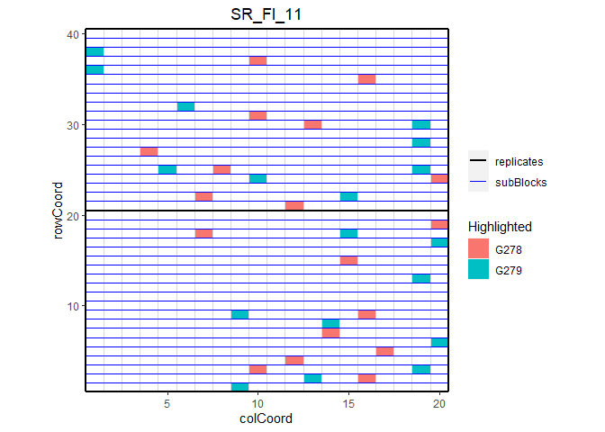
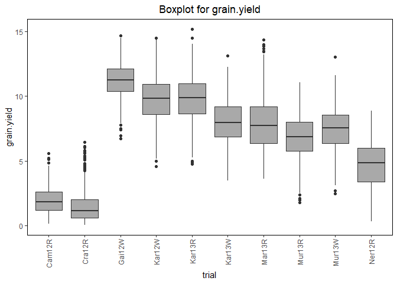
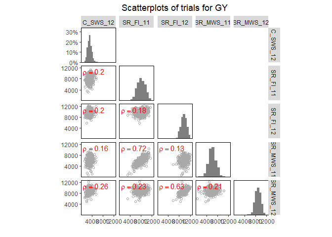
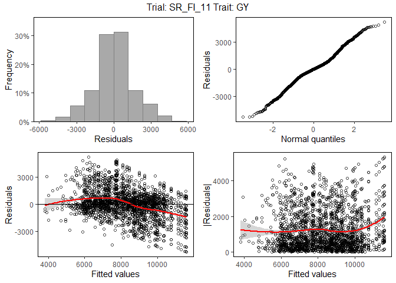
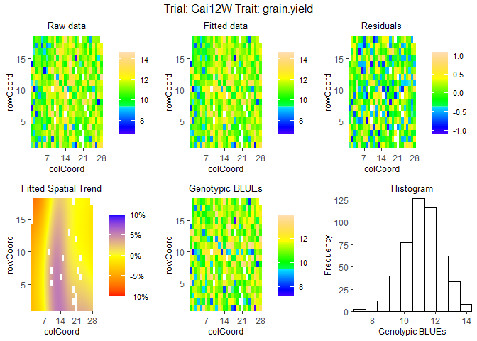

<!-- README.md is generated from README.Rmd. Please edit that file -->

# statgenSTA

[](https://www.r-pkg.org/pkg/statgenSTA)
[](https://www.r-pkg.org/pkg/statgenSTA)
[](https://github.com/Biometris/statgenSTA/actions?workflow=R-CMD-check)
[](https://codecov.io/gh/Biometris/statgenSTA)

**statgenSTA** is an R package providing functions for phenotypic
analysis of agricultural field trials using mixed models with and
without spatial components.

Analysis can be done using one of the R packages **SpATS**, **lme4** or
**asreml**. For the latter a license is required which can be obtained
upon purchase from [VSNi](http://www.vsni.co.uk/software/asreml-r).

statgenSTA has extensive options for summarizing and visualizing both
the raw data and the fitted models. The example below shows a selection
of what is possible. For a full overview of all options it is best to
read the
[**vignette**](https://biometris.github.io/statgenSTA/articles/statgenSTA.html)

## Installation

  - Install from CRAN:

<!-- end list -->

``` r
install.packages("statgenSTA")
```

  - Install latest development version from GitHub (requires
    [remotes](https://github.com/r-lib/remotes) package):

<!-- end list -->

``` r
remotes::install_github("Biometris/statgenSTA", ref = "develop", dependencies = TRUE)
```

## Examples

Example using the phenotypic data for a wheat trial in Chile. The same
data is used in the vignette and described there in detail.

First get the data in the form required by the package, converting it to
an object of class **T(rial)D(ata)**.

``` r
library(statgenSTA)
data("wheatChl")
wheatTD <- createTD(data = wheatChl, genotype = "trt", repId = "rep",
            subBlock = "bl", rowCoord = "row", colCoord = "col")
```

Some plots to get a first idea of the contents of the data.

``` r
## Plot the layout for SR_FI_11 with genotypes G278 and G279 highlighted.
plot(wheatTD, plotType = "layout", trials = "SR_FI_11", highlight = c("G278", "G279"))
```



``` r
## Create a boxplot for grain yield.
plot(wheatTD, plotType = "box", traits = "GY")
```



``` r
## Create a scatter plot matrix for grain yield.
## Add correlations between trials in top left of scatter plots.
plot(wheatTD, plotType = "scatter", traits = "GY", addCorr = "tl")
```



Fit mixed models for one of the trials, SR\_FI\_11, and visualize the
output.

``` r
## Fit a single trial model using a model based on a resovable row column design.
modWheatSp <- fitTD(TD = wheatTD, trials = "SR_FI_11", traits = "GY", design = "res.rowcol")
#> Using SpATS for fitting models.
```

``` r
## Base plots for the model with genotype fitted as random effect.
plot(modWheatSp, plotType = "base", what = "random")
```



``` r
## Spatial plot for the model with genotype fitted as fixed effect.
## Display the spatial trend as a percentage.
plot(modWheatSp, plotType = "spatial", spaTrend = "percentage")
```


